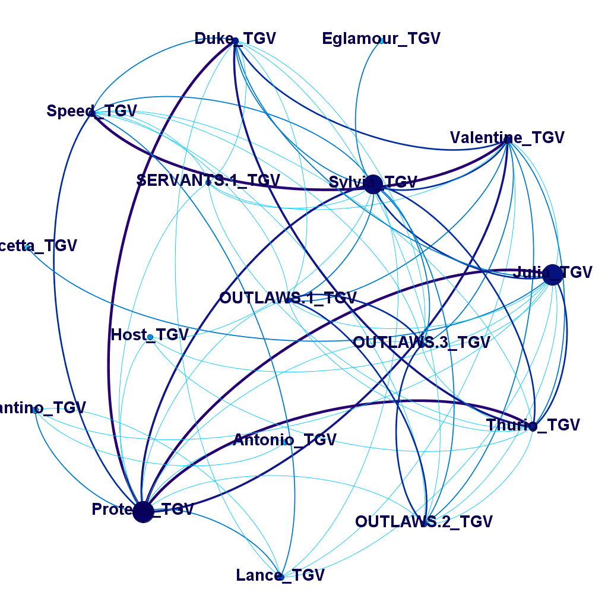
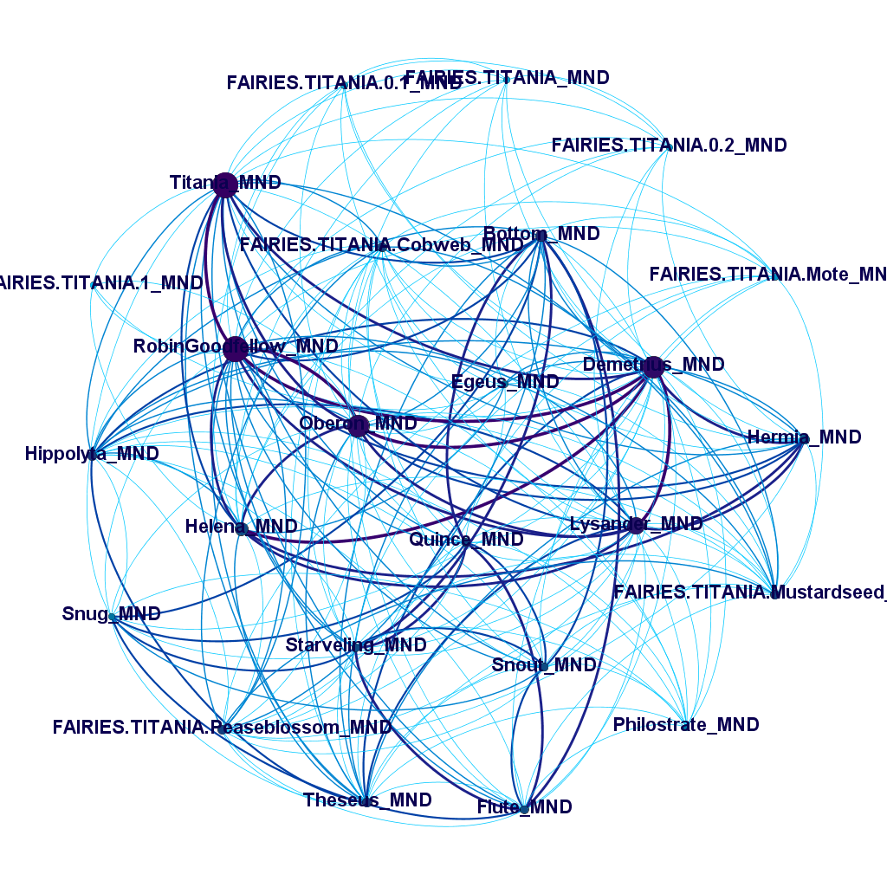
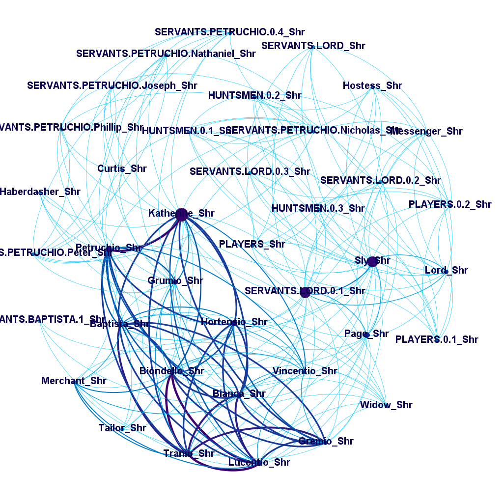
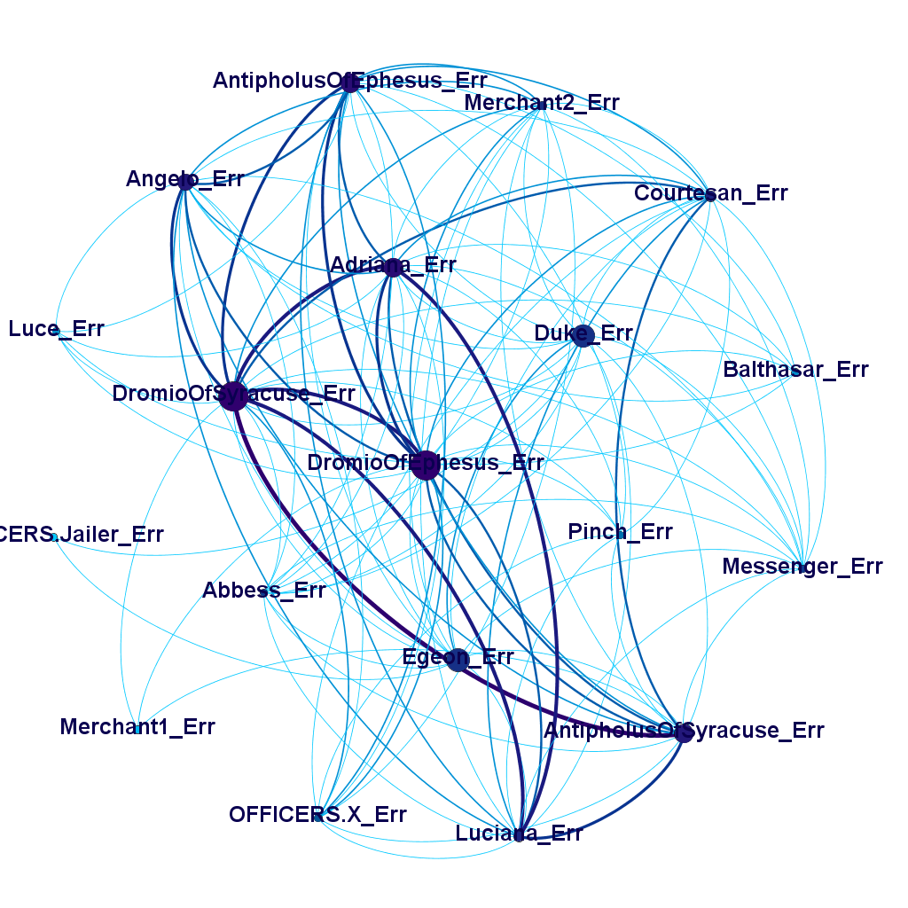
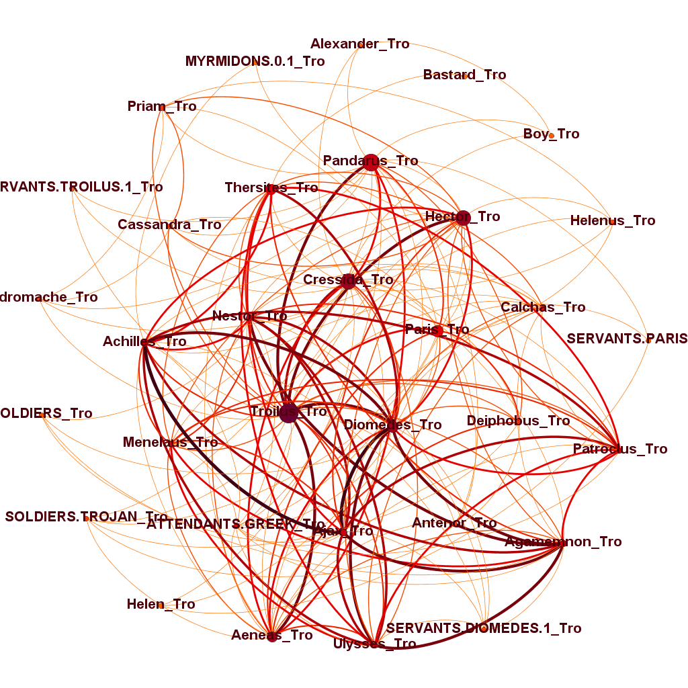
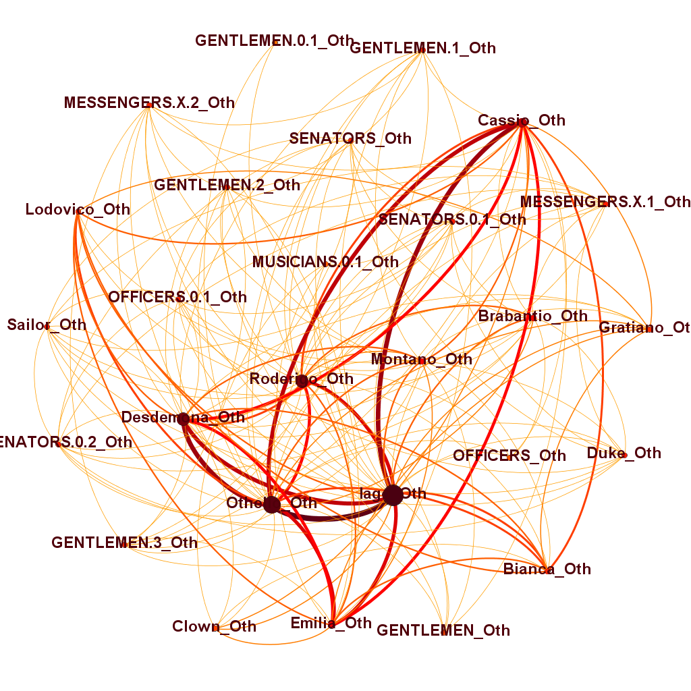
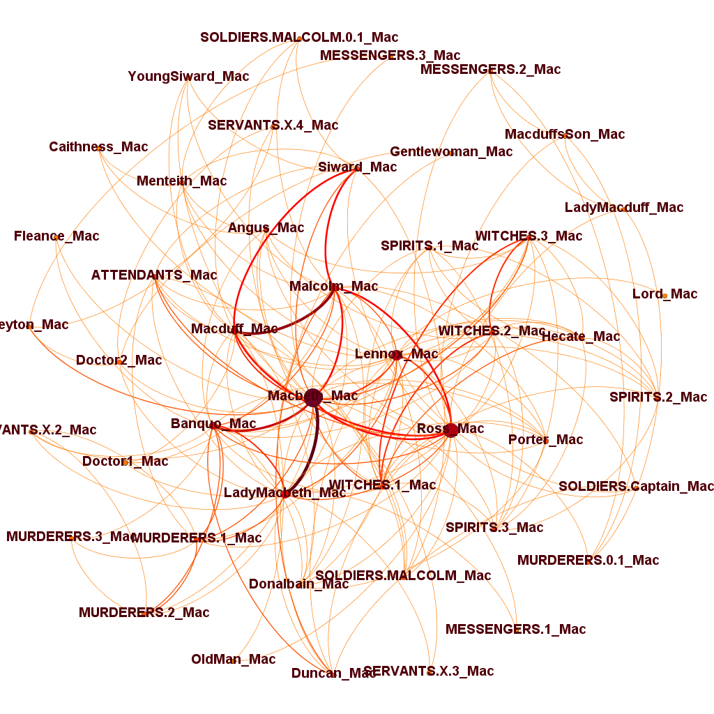

# Применение сетевого анализа для проверки гипотез Б.И.Ярхо относительно классификации драматургических произведений на примере Шекспира
## Предпосылки и задача:

В своём этюде _"Комедии и трагедии Корнеля"_ Борис Ярхо выделил несколько параметров, по которым с точки зрения литературоведения можно однозначно отличить комедию от трагедии.

Однако эти признаки выделялись только на основе творчества французского драматурга Пьера Корнеля; мы ставим своей целью исследовать проявление данных свойств в творчестве Уильяма Шекспира.

## Методология

Данные были скачаны с [сайта Драматического корпуса](https://dracor.org/shake) и загружены в Gephi. Для исследования были случайно выбраны 4 комедии (_Сон в летнюю ночь_, _Два веронца_, _Укрощение строптивой_ и _Комедия ошибок_) и 4 трагедии (_Тит Андроник_, _Макбет_, _Отелло_ и _Троил и Крессида_). Затем они были загружены в Gephi, проанализированны и экспортированы на сайт.

## Результаты

- _"Комедийный персонаж активнее трагедийного"_
__не подтвердилось/не подверждаемо__
- _"Слуги здесь могут обладать большей величиной роли и выполнять большее число функций."_
__подтвердилось__
- _"Реплики в комедиях чаще связаны рифмой, а стихи чаще разорваны между репликами."_
?? непонятно

- Сильной разницы в числах тоже не было заметно: во всех произведениях примерно одинаковая средняя и средняя взвешенная степень (от 7 до 16), группировка по остальным параметрам также не оказалась успешной

- Корнель не является ни современником, ни соотечественником Шекспира
